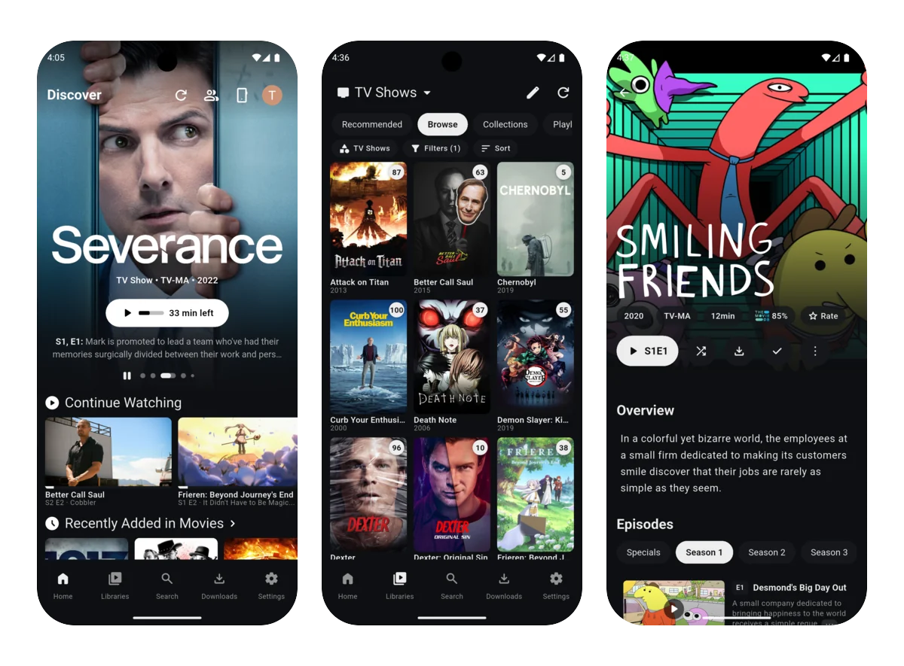

<h1>
  
  Plezy
</h1>

A modern client for Plex and Jellyfin on desktop, mobile, and TV. Built with Flutter for native performance and a clean interface.

<p>
  <a href="#download">Download</a> ·
  <a href="CONTRIBUTING.md">Contributing</a> ·
  <a href="LICENSE">License</a>
</p>

<p align="center">
  
</p>

## Download

Grab the latest build from the [GitHub releases](https://github.com/toffbrawny/plezy/releases):

| Platform | Download |
| --- | --- |
| Android (arm64) | [`Plezy-v3.0.0-arm64.apk`](https://github.com/toffbrawny/plezy/releases/latest/download/Plezy-v3.0.0-arm64.apk) — sideload on your device |
| iPad / iOS | No prebuilt download — build it yourself with a free Apple account (see [Building for iOS / iPadOS](#building-for-ios--ipados-free-apple-developer-account)). Free-account installs expire after 7 days |

> **Note on the Android APK:** this build uses the upstream package id `com.edde746.plezy` and is signed with the maintainer's debug key, which is **different from the official Plezy's signing key**. If you have the official Plezy installed (e.g. from Google Play), this APK **will not install alongside it** — Android rejects the same package id with a different signature ("App not installed"). Uninstall the official Plezy first, then sideload this build.

## Features

###  Browse & Discover
- Libraries, collections, and playlists
- Discover hub — Continue Watching, Next Up, trending, and recommendations
- Cross-server search
- Filtering, sorting, and alphabetical jump navigation
- Extras — trailers, deleted scenes, behind-the-scenes

###  Playback
- Wide codec support (HEVC, AV1, VP9, and more)
- HDR and Dolby Vision[^1]
- Full ASS/SSA subtitles with customizable styling
- Online subtitle search & download[^2]
- Audio & subtitle choices remembered per title
- Progress sync and resume
- Auto-play next episode with skip intro / skip credits
- Chapter navigation with thumbnail scrub previews
- Playback speed, audio sync offset, sleep timer
- Ambient lighting and GLSL shader presets[^3]
- Picture-in-Picture[^4]
- Refresh-rate matching[^5]
- External player launch (VLC, MX Player, etc.)

###  Live TV & DVR
- Live TV channel browsing with favorites
- DVR support with EPG guide, recording rules, and scheduled recordings[^2]
- Multi-server Live TV support where available

###  Downloads & Offline
- Download media for offline viewing
- Background queue with pause / resume
- Sync rules for automatic downloads
- Offline browsing with watch state sync-back on reconnect

###  Watch Together
- Synchronized playback with friends
- Real-time play / pause / seek sync

###  Integrations
- Discord Rich Presence[^7]
- Trakt, MyAnimeList, AniList, and Simkl tracking & rating
- Plezy Remote — control desktop and TV from mobile
- Watch Next row[^6]

###  Platform & Customization
- Desktop, mobile, and TV — full D-pad, keyboard, and gamepad support
- Customizable keyboard shortcuts[^7]
- Metadata and artwork editing[^2]
- Settings import/export
- Localized in English plus 14 translations

[^1]: Not available on Linux.
[^2]: Plex only.
[^3]: Not available on iOS or tvOS.
[^4]: Android, iOS, and macOS.
[^5]: Windows, Android, and tvOS.
[^6]: Android TV only.
[^7]: Desktop only.

## Building from Source

### Prerequisites
- Flutter SDK 3.44.0+
- A Plex account or Jellyfin server with user credentials

### Setup

```bash
git clone https://github.com/toffbrawny/plezy.git
cd plezy
flutter pub get
scripts/codegen.sh
flutter run
```

### Code Generation

After modifying model classes or other generated sources:

```bash
scripts/codegen.sh
```

After modifying translations:

```bash
dart run slang
```

### Local Checks

```bash
scripts/ci_checks.sh
```

To install the same pre-commit checks locally:

```bash
scripts/setup_hooks.sh
```

## Building for iOS / iPadOS (free Apple Developer account)

There is **no prebuilt iOS download**. A free Apple Developer account can only sign apps for *your own registered devices*, so a published `.ipa` wouldn't install for anyone else (and it expires after 7 days). Build it yourself — it takes a few minutes.

### Prerequisites
- Xcode 16.x with an iOS Simulator runtime installed
- Flutter SDK on `PATH`
- A JDK — set `JAVA_HOME` (e.g. Amazon Corretto 21)
- A free Apple ID added to Xcode → **Settings → Accounts**
- Your iPad/iPhone paired via USB and trusted (wireless works once paired)

### One-time: use your own signing identity
The iOS target is configured with the maintainer's bundle ID and team. To build under **your** free account, edit `ios/Runner.xcodeproj/project.pbxproj`:
- `PRODUCT_BUNDLE_IDENTIFIER` → your own unique value (e.g. `com.<your-handle>.plezy`)
- `DEVELOPMENT_TEAM` → your Apple Developer team ID (Xcode → Settings → Accounts)

### Build, export, and install
```bash
export JAVA_HOME=/path/to/jdk
export PATH="$JAVA_HOME/bin:$PATH"

# 1. Build the archive. The default export step fails on a free account — that's expected;
#    the archive is still produced at build/ios/archive/Runner.xcarchive
flutter build ipa --release

# 2. Export with development signing (free-account compatible)
cat > /tmp/export.plist <<'EOF'
<?xml version="1.0" encoding="UTF-8"?>
<!DOCTYPE plist PUBLIC "-//Apple//DTD PLIST 1.0//EN" "http://www.apple.com/DTDs/PropertyList-1.0.dtd">
<plist version="1.0">
<dict>
  <key>method</key><string>debugging</string>
  <key>teamID</key><string>YOUR_TEAM_ID</string>
  <key>signingStyle</key><string>automatic</string>
  <key>compileBitcode</key><false/>
</dict>
</plist>
EOF

xcodebuild -exportArchive \
  -archivePath build/ios/archive/Runner.xcarchive \
  -exportOptionsPlist /tmp/export.plist \
  -exportPath build/ios/ipa \
  -allowProvisioningUpdates

# 3. Install on your device (find the ID with: xcrun devicectl list devices)
xcrun devicectl device install app --device YOUR_IPAD_ID build/ios/ipa/*.ipa
```

### 7-day refresh
Free-account installs **expire after 7 days**. Rebuild and reinstall to refresh — app settings and data are preserved across reinstalls. The `reinstall_ipad.sh` template in this repo automates the build → export → install steps; set the `IPAD_ID`, `TEAM_ID`, and `JAVA_HOME` environment variables and run it.

> **macOS:** no prebuilt/download is provided, and macOS builds currently require a newer Xcode/MPVKit toolchain than this setup targets — see [CONTRIBUTING.md](CONTRIBUTING.md) for the general build workflow.

## Contributing

See [CONTRIBUTING.md](CONTRIBUTING.md) for development workflow, formatting, tests, and translation guidelines.

## License

Plezy is licensed under [GPL-3.0](LICENSE).

## Acknowledgments

- Built with [Flutter](https://flutter.dev)
- Supports [Plex Media Server](https://www.plex.tv) and [Jellyfin](https://jellyfin.org)
- Playback powered by [mpv](https://mpv.io), [MPVKit](https://github.com/mpvkit/MPVKit), Android [ExoPlayer](https://developer.android.com/media/media3/exoplayer), [libass-android](https://github.com/peerless2012/libass-android), and [libmpv-android](https://github.com/jarnedemeulemeester/libmpv-android)

---

## New features (this fork)

This fork builds on Plezy with the following additions:

- **Client-side Watchlist** — bookmark movies/shows/seasons/episodes; stored locally on-device, works offline.
- **Seer integration** — connect to Jellyseerr/Overseerr to request media and browse trending, genres, studios, and networks.
- **StreamyStats AI recommendations** — vector-based movie & series recommendations in the Search tab.
- **Genre / Studio / Network discovery** with request enrichment.
- **iOS / iPadOS support** — app icon and free-Apple-account build fixes (team ID, bundle ID, Xcode 16.2 Swift compatibility).

Mirrored from [git.toffbrawny.com/toffbrawny/plezy](https://git.toffbrawny.com/toffbrawny/plezy).